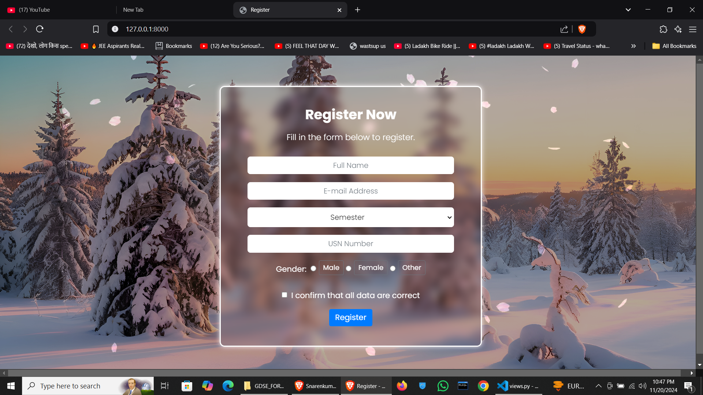
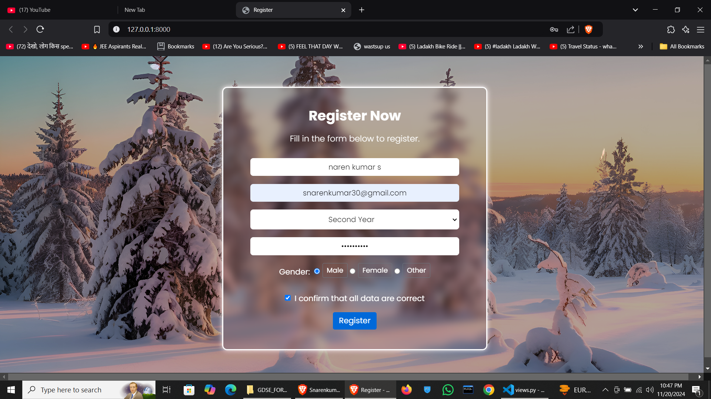
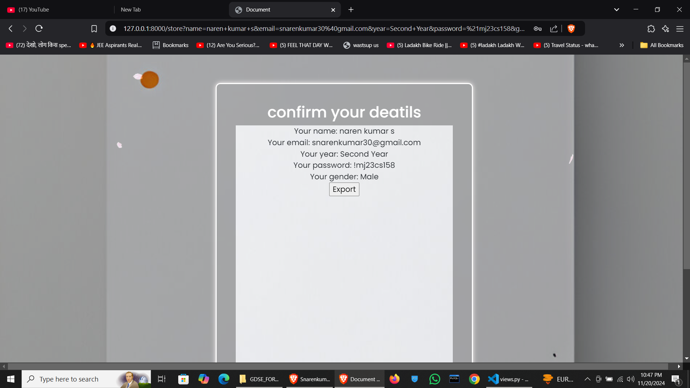
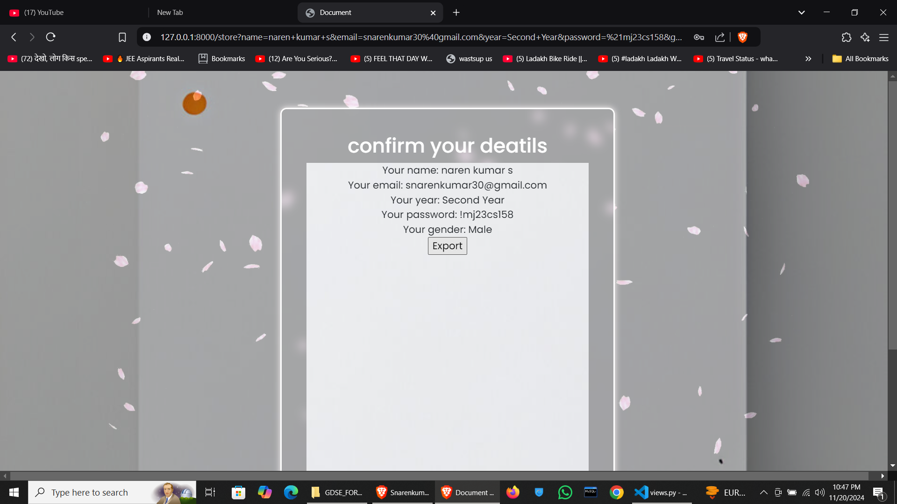
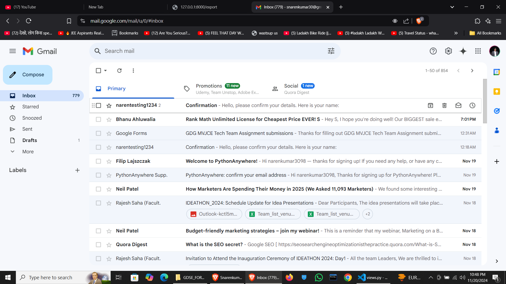
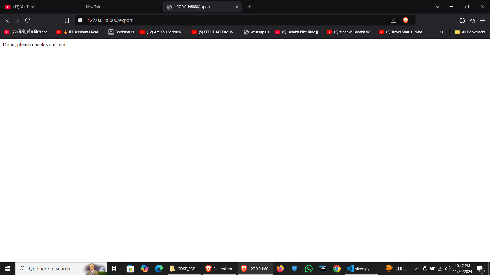
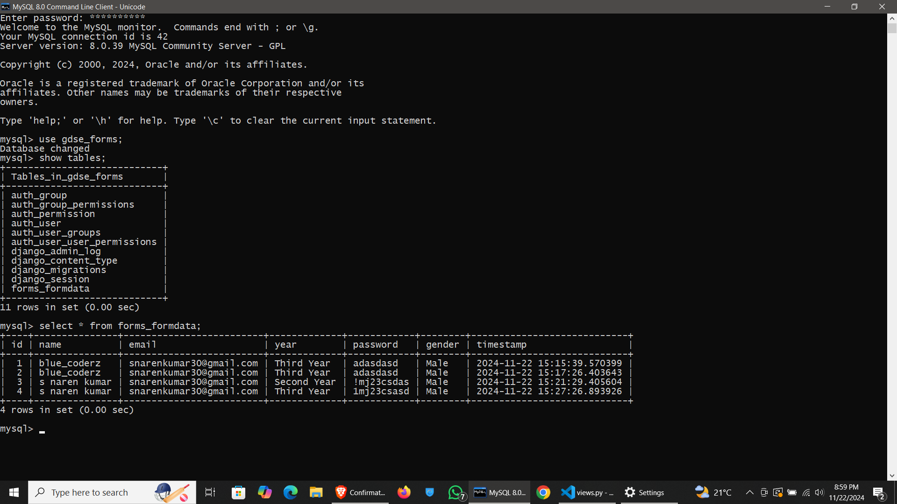

# 📝 Django Form Project  

Welcome to the **Django Form Project**! This application demonstrates a user-friendly form submission process with validation, redirection, and email notification features. Built using **Django**, **HTML**, **CSS**, **JavaScript**, and **jQuery**, this project also integrates **MySQL** for backend data management.  


> 🛑 **Important Note**:  
> The hosted project is available at [https://narensporttify.pythonanywhere.com/](https://narensporttify.pythonanywhere.com/).  
> However, due to backend issues, such as database connectivity problems with the hosting platform, the project may not load as expected.  
> You can still run the project locally by following the instructions below.

---
</br>

# Watch The Demo Video Of The Project By Clicking The Image Below :

</br> 

[](https://drive.google.com/file/d/1gyDZBWknzMcFiSFfpcHiAC6fnsopm0OJ/view?usp=sharing)</br> 

---
</br> 


## 🌟 Project Features  

### 🌐 **Starting Page: `index.html`**  


</br> 
<p align="center">
  
</p>


- Input fields for:  
  - **Name**  
  - **Email**  
  - **Year**  
  - **USN** (University Serial Number)  
  - **Gender**  
  - A **checkbox** to accept terms and conditions.  
- Form validation to ensure proper data entry.  
- On submission, users are redirected to the **base.html** page.  
</br>
</br> 
<p align="center">
  
</p>

---

### 🔍 **Confirmation Page: `base.html`**  
</br>
</br>
- Displays the details entered by the user for review.  
- Users can:  
  - **Cross-check their input** for accuracy.  
  - Click the **Export** button to send their details via email for further verification.  
</br>
</br> 
<p align="center">
  
</p>
</br>
</br> 
<p align="center">
  
</p>
</br>
---

### 📧 **Email Notification**  
- Upon clicking **Export**, the entered details are sent to the user’s email.  
- Ensures the data entered is correct and provides an additional layer of verification.

  </br>
</br> 
<p align="center">
  
</p>

---
</br>
### ✅ **Final Page: `final.html`**  
- Displays a **Django HttpResponse** confirming:  
  > "Mail has been sent. Please check."
</br>
</br> 
<p align="center">
  
</p>
 

---
</br>

# 📌Database look:

---
</br> 
<p align="center">
  
</p>
</br>
---
</br>

## 🛠️ Technologies Used  
</br>
- **Django**: For backend logic and framework support.  
- **HTML & CSS**: For structuring and styling the pages.  
- **JavaScript & jQuery**: For interactive and dynamic elements.  
- **MySQL**: For database management.  

---

## 🚀 How to Run the Project Locally  

1. Clone the repository:  
   ```bash
   git clone <repository-url>
   cd <repository-folder>
